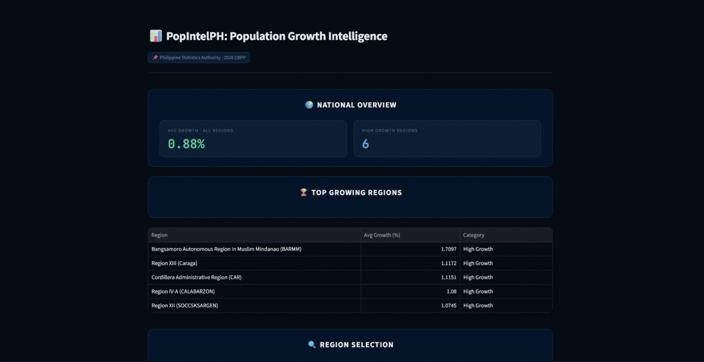
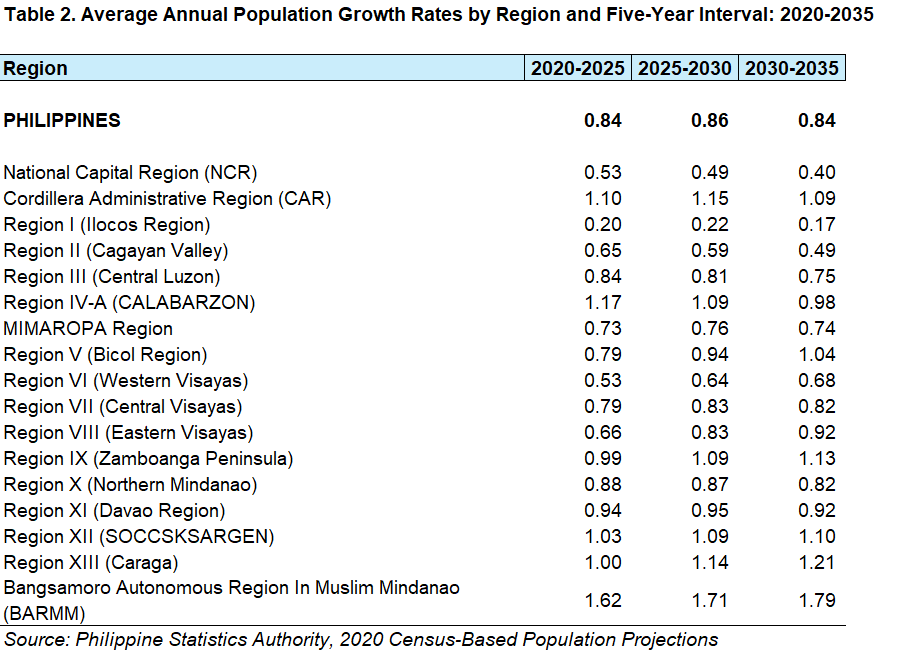
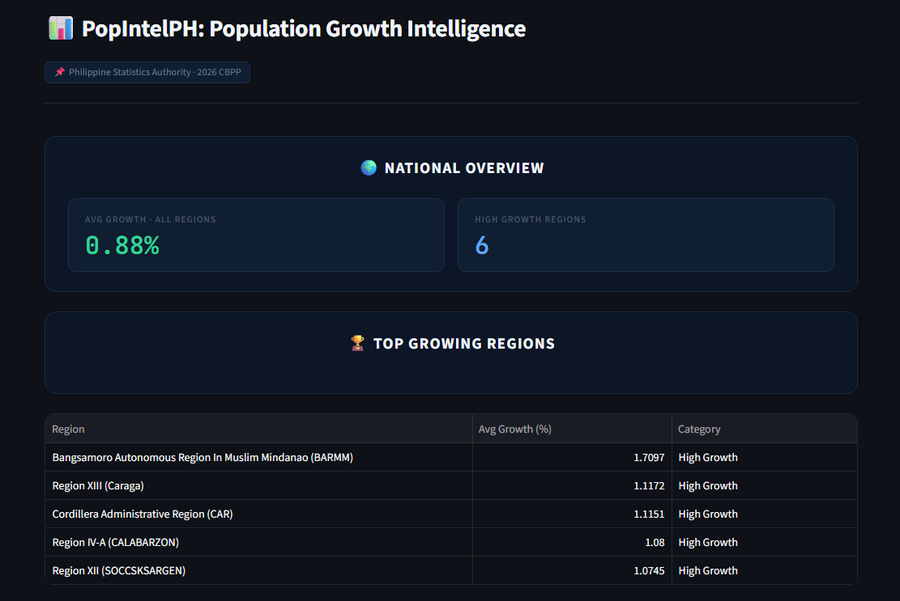
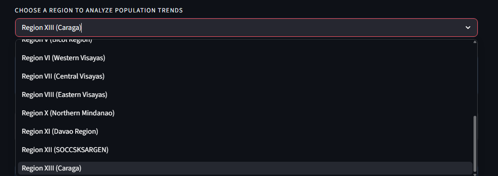
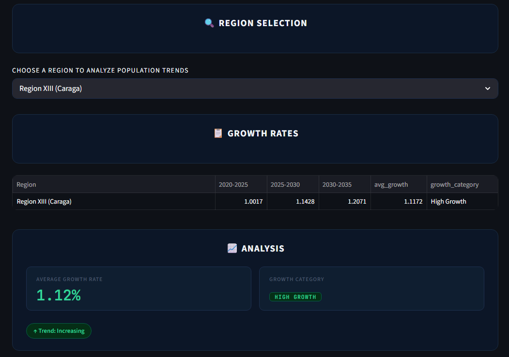
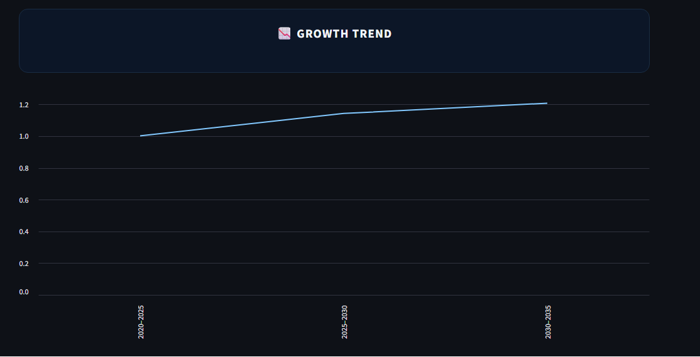
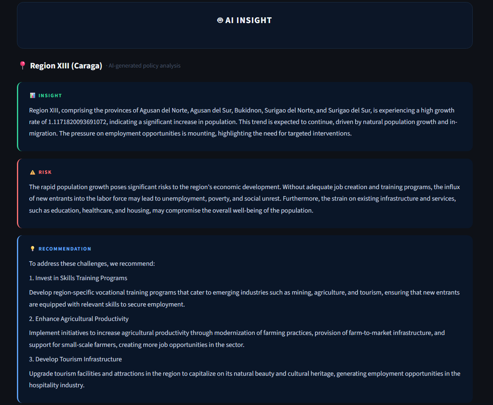

# PopIntelPH: Population Growth Intelligence


-green>)


---

## Demo




---

## Overview

PopIntelPH is a data analytics dashboard that analyzes regional population growth trends in the Philippines using official data from the Philippine Statistics Authority (PSA). It combines data visualization, statistical analysis, and features an AI-powered analysis using a local AI model (Llama 3 via Ollama) to generate actionable policy insights for each region.

The dataset is based on the Philippine Statistics Authority’s 2020 Census-Based Population Projections (CBPP), released on January 13, 2026, which estimate regional population growth (2020–2035) using the cohort-component method incorporating fertility, mortality, and migration trends.



This project specifically utilizes Table 2 (Average Annual Population Growth Rates) from the PSA dataset, as it directly provides summarized regional growth trends across defined time intervals (2020–2035). Unlike other tables that contain detailed demographic breakdowns (e.g., age groups or sex), Table 2 is already structured for comparative analysis, making it ideal for visualization, categorization, and AI-driven insights.

Inside this repo may also contain extra miscellanous data for more information about the origins of the dataset that was utilized in this project.

---

## Flow:

1. Load PSA dataset
2. Clean + transform data
3. Compute metrics
4. Visualize via Streamlit
5. Send structured prompt to Llama 3 (Ollama)
6. Parse + render AI insights

---

## Features

- Interactive dashboard
- Top growth detection
- Statistical insights
- Trend visualization
- AI-generated insights (local LLM)

---

## AI Integration

- Ollama (local runtime)
- Llama 3 model
- No external API
- Fully offline capable

---

## Project Structure

```
popintelph/
│
├── app.py             # Main Streamlit app
├── inspect_data.py    # Data cleaning script
│
├── data/
│ ├── clean_population_growth.csv                          # normalized data
│ └── Statistical Tables (2020 CBPP Subnational).xlsx      # raw data (utilized Table 2)
│ └── Press Release (2020 CBPP Subnational).pdf            # extra miscellaneous data
│ └── Technical Notes (2020 CBPP Subnational).pdf          # extra miscellaneous data
│
├── styles/
│ └── main.css         # UI styling
│
├── requirements.txt
└── README.md
```

---

## Installation

```bash
git clone https://github.com/YOUR_USERNAME/popintelph.git
cd popintelph
python -m venv venv
source venv/Scripts/activate
pip install -r requirements.txt
```

---

## Setup Ollama

```bash
ollama pull llama3
ollama run llama3
```

---

## Run

```bash
streamlit run app.py
```

---

## Screenshots

### Dashboard Overview



### Select Region Dropdown



### Regional Growth Rate & Analysis



### Growth Trend Graph



### AI Insight Panel



---

## Limitations

- Requires local Ollama
- Not cloud-deployable (without server setup)

---

## Author

Ralph Henry L. Dominisac
